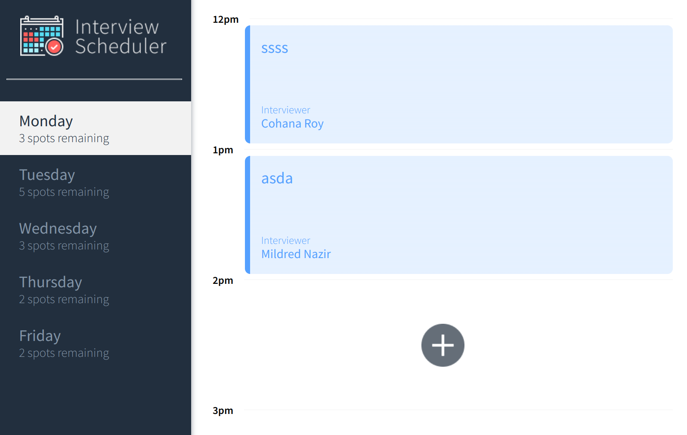
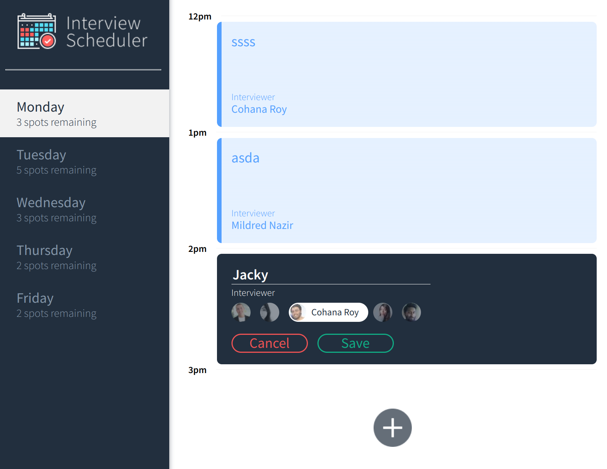
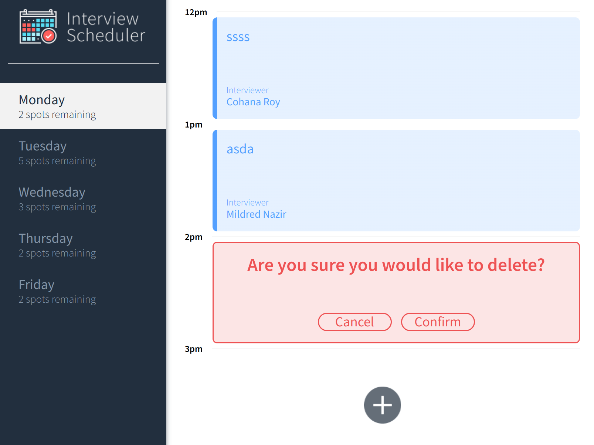

# Interview Scheduler
Interview Scheduler is a single-page application where users can book interview by selecting time/day and interviewer.
The React frameworks will make a request for data to an api and store it in react state.

A separate scheduler-api is required to run this app. [Link is here.](https://github.com/jackiestchen/scheduler-api)

# Scope
* 5 interview slots are available per weekday. 
* Interviewers are only available from Monday to Friday, 12pm - 5pm.
* Each interview is 1 hour long. 
* User can add name, edit, and delete appointment.
* All details such remaining available appointments are dynamically rendered.

# Screenshots
## Main Page


## Booking Interview 


## Delete Interview 


## Setup

Install dependencies with `npm install`.

## Running Webpack Development Server

```sh
npm start
```

## Running Jest Test Framework

```sh
npm test
```

## Running Storybook Visual Testbed

```sh
npm run storybook
```

## Instructions
* Run scheduler-api in scheduler-api folder
  ```
  npm start
  ```
* Run scheduler in scheduler folder
  ```
  npm start
  ```

## Dependencies
* axios
* classnames
* normalize.css
* React
* Storybook
* jest
